# Extensiones útiles

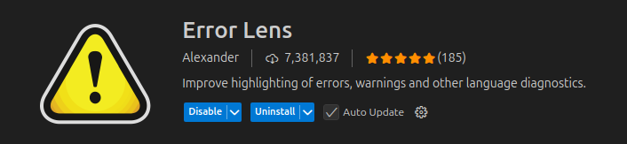 

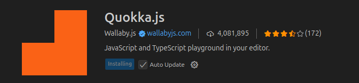 

 

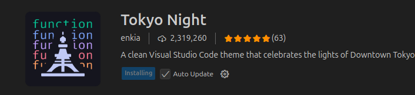 

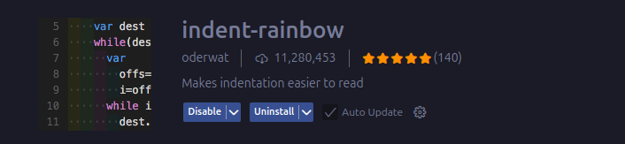 

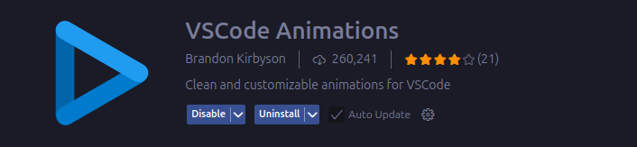 

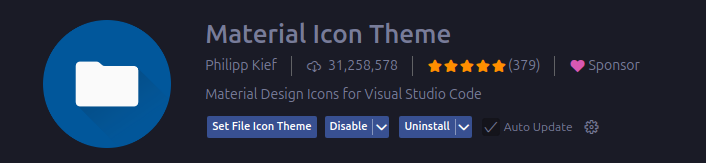

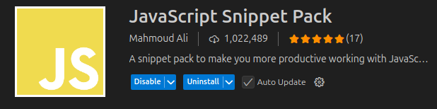


# Cuerpo del index.html
```html
<!DOCTYPE html>
<html lang="en">
<head>
  <meta charset="UTF-8">
  <meta name="viewport" content="width=device-width, initial-scale=1.0">
  <title>Document</title>
  <link rel="stylesheet" href="css/estilo.css">
</head>
<body>
   <div class="area" role="application" aria-label="Pacman canvas">
    <canvas id="lienzo" width="800" height="800"></canvas>
  </div>
  <script src="js/pacman.js"></script>
</body>
</html>
```
Hay 2 parámetros ARIA importantes en el div que contiene el canvas del juego.

* **role="application"**
      Este atributo ARIA (Accessible Rich Internet Applications) marca el div como una aplicación o componente complejo en lugar de un simple contenido de página.
      Es útil para dar a entender a las tecnologías de asistencia que el área tiene una interacción compleja, en este caso, el juego de Pacman.
  
*  **aria-label="Pacman canvas"**
      Este atributo ARIA proporciona una descripción textual del elemento

El resto de archivos referenciados en el index.html son el archivo de estilos CSS y el archivo JavaScript que contiene la lógica del juego.

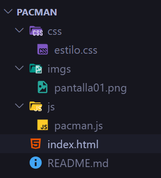


# Estilos para la página web

Permitirá que el elemento canvas que se agregarás después se centre en la pantalla con un fondo degradado.

```css
:root {
  --size: 800px;
  --bg-init: #051025;
  --bg-end: #072037;
}


body {
  height: 100vh;
  margin: 0;
  display: flex;
  align-items: center;
  justify-content: center;
  background: linear-gradient(135deg, var(--bg-init) 0%, var(--bg-end)  100%);
}
```

## Estilos para el área del juego

```css

.area {
  width: var(--size);
  height: var(--size);
  box-shadow: 0 8px 30px rgba(2, 6, 23, 0.7);
  border-radius: 12px;
  box-sizing: border-box;
  background: radial-gradient(circle at 30% 10%, rgba(255,255,255,0.05), transparent 20%),
                  linear-gradient(0deg, rgba(255,255,255,0.05), transparent 60%); 
   
}
```

Al hacer estos pasos, el elemento canvas estará centrado en la pantalla con un fondo atractivo, y el área del juego tendrá un diseño visualmente agradable con sombras y degradados.

La siguiente imagen muestra cómo se verá la página web con los estilos aplicados:

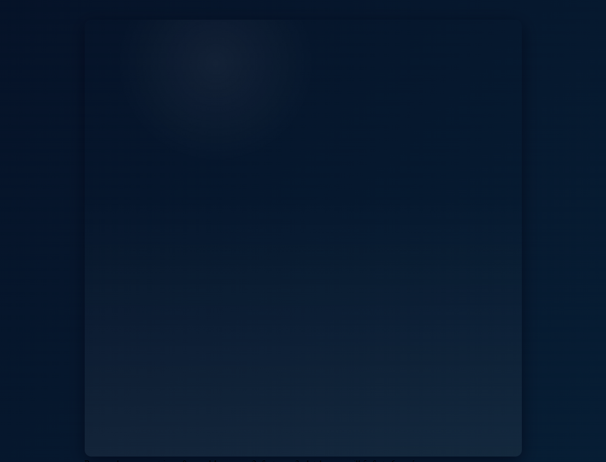


# Lógica del juego en JavaScript


Se inicia con la lógica del mapa del juego, definiendo una matriz que representará los diferentes elementos del juego.

## Matriz del mapa del juego
```javascript
/**
 0 = pared
 1 = pacman 
 2 = fantasma
 3 =  pastilla pequeña
 4 = pastilla grande (power)
 5 = fruta
 6 = pasillo
 */
const MAPA = [
  [0, 0, 0, 0, 0, 0, 0, 0, 0, 0, 0, 0, 0, 0, 0, 0, 0, 0, 0, 0],
  [0, 3, 3, 3, 3, 3, 3, 3, 3, 0, 3, 3, 3, 3, 3, 3, 3, 3, 3, 0],
  [0, 3, 0, 0, 0, 3, 0, 0, 3, 0, 3, 0, 0, 0, 3, 0, 0, 0, 3, 0],
  [0, 4, 0, 2, 0, 3, 0, 2, 3, 0, 3, 2, 0, 2, 3, 0, 2, 0, 4, 0],
  [0, 3, 0, 0, 0, 3, 0, 0, 3, 0, 3, 0, 0, 0, 3, 0, 0, 0, 3, 0],
  [0, 3, 3, 3, 3, 3, 3, 3, 3, 3, 3, 3, 3, 3, 3, 3, 3, 3, 3, 0],
  [0, 3, 0, 0, 0, 3, 0, 0, 3, 0, 3, 0, 0, 0, 3, 0, 0, 0, 3, 0],
  [0, 3, 0, 5, 0, 3, 0, 1, 3, 0, 3, 1, 0, 5, 3, 0, 2, 0, 3, 0],
  [0, 3, 3, 3, 3, 3, 3, 3, 3, 0, 3, 3, 3, 3, 3, 3, 3, 3, 3, 0],
  [0, 0, 0, 0, 0, 0, 0, 3, 0, 0, 0, 3, 0, 0, 0, 0, 0, 0, 0, 0],
  [0, 3, 3, 3, 3, 3, 3, 3, 3, 3, 3, 3, 3, 3, 3, 3, 3, 3, 3, 0],
  [0, 3, 0, 0, 0, 3, 0, 0, 3, 0, 3, 0, 0, 0, 3, 0, 0, 0, 3, 0],
  [0, 4, 0, 2, 0, 3, 0, 2, 3, 0, 3, 2, 0, 2, 3, 0, 2, 0, 4, 0],
  [0, 3, 0, 0, 0, 3, 0, 0, 3, 0, 3, 0, 0, 0, 3, 0, 0, 0, 3, 0],
  [0, 3, 3, 3, 3, 3, 3, 3, 3, 0, 3, 3, 3, 3, 3, 3, 3, 3, 3, 0],
  [0, 3, 0, 0, 0, 3, 0, 0, 3, 0, 3, 0, 0, 0, 3, 0, 0, 0, 3, 0],
  [0, 3, 0, 5, 0, 3, 0, 6, 3, 0, 3, 6, 0, 5, 3, 0, 2, 0, 3, 0],
  [0, 3, 3, 3, 3, 3, 3, 3, 3, 0, 3, 3, 3, 3, 3, 3, 3, 3, 3, 0],
  [0, 3, 3, 3, 3, 3, 3, 3, 3, 3, 3, 3, 3, 3, 3, 3, 3, 3, 3, 0],
  [0, 0, 0, 0, 0, 0, 0, 0, 0, 0, 0, 0, 0, 0, 0, 0, 0, 0, 0, 0]
]


const ROWS = MAPA.length;
const COLS = MAPA[0].length;

```

Esta matriz define el diseño del mapa del juego, donde cada número representa un elemento diferente, como paredes, pacman, fantasmas, pastillas y pasillos.
Con esta estructura básica, se puede comenzar a construir la lógica del juego de Pacman, renderizar el mapa en el canvas y manejar la interacción del jugador.


Adicionalmente, se calcula el número de filas y columnas del mapa utilizando las propiedades `length` de la matriz para el total de filas, y de la primera fila para el total de columnas.

## Se obtiene la referencia al canvas

```javascript
//  Canvas y contexto
const canvas = document.getElementById('lienzo')
const ctx = canvas.getContext('2d')
``` 


## Tamaño de cada cuadro a dibujar en el canvas

Para facilitar el dibujo del mapa en el canvas, se calcula el tamaño de cada cuadro (tile) dividiendo el ancho del canvas entre el número de columnas del mapa. Se considera que el canvas es cuadrado, por lo que el ancho y alto son iguales.

```javascript
    // calculamos el tamaño del cuadroi/tile según el canvas
    const TILE_SIZE = canvas.width / COLS;  // cuadrícula uniforme
```


Con estos pasos, se establece la base para renderizar el mapa del juego de Pacman en el canvas, utilizando la matriz definida anteriormente y el tamaño calculado para cada cuadro.

## Dibujo de una pared en el canvas

Antes, en la siguiente figura se muestra cómo se dibuja un arco para crear un rectángulo redondeado en el canvas.


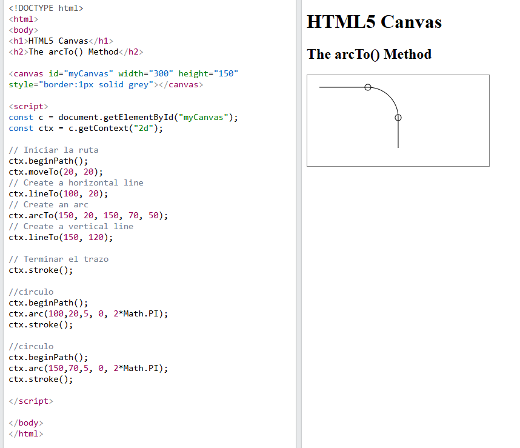


Para dibujar una pared en el canvas, se puede crear una función que utilice el contexto del canvas para dibujar un rectángulo redondeado en la posición especificada. Aquí hay un ejemplo de cómo se podría implementar esta función:

```javascript
function roundRect (ctx, x, y, w, h, r) {
  ctx.beginPath()
  ctx.moveTo(x + r, y)
  ctx.arcTo(x + w, y, x + w, y + h, r)
  //ctx.arcTo(x + w, y + h, x, y + h, r);
  //ctx.arcTo(x, y + h, x, y, r);
  //ctx.arcTo(x, y, x + w, y, r);
  ctx.closePath()
}
```

Un bloque de pared, se dibuará utilizando la función `roundRect` para crear un rectángulo redondeado en la posición especificada. Aquí hay un ejemplo de cómo se podría implementar esta función:

```javascript

function dubujarPared (
  ctx,
  c,  r,   // col, fila
  size,
  relleno = '#14315a',
  colorPared = 'rgba(255,255,255,0.4)'
) {
  const x = c * size
  const y = r * size
  const pad = Math.max(2, size * 0.12)

  ctx.save()
  ctx.fillStyle = relleno
  // pared con "borde" brillante
  ctx.fillRect(x + pad, y + pad, size - pad * 2, size - pad * 2)

  // highlight
  ctx.strokeStyle = colorPared
  ctx.lineWidth = Math.max(1, size * 0.02)
  roundRect(ctx, x + pad, y + pad, size - pad * 2, size - pad * 2, 4)
  ctx.stroke()

  ctx.restore()
}

``` 

Puedes probar la función con una llamada como la siguiente:

```javascript
dubujarPared(ctx, 0, 0, TILE_SIZE*5)
```

Se obtendrá algo como lo que se muestra en la siguiente imagen:

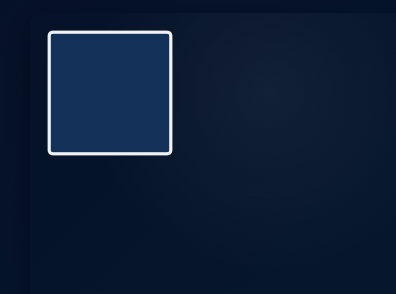

Recuerda quitarlo, o comentarlo después de probarlo.

Con esta función, puedes dibujar paredes en el canvas en las posiciones especificadas por las columnas y filas, utilizando el tamaño definido para cada cuadro.


## Dubujo de una pastilla


```javascript

function dibujarPunto (ctx, c, r, size, relleno='#ffe9a3' ) {
  const cx = c * size + size / 2
  const cy = r * size + size / 2
  const radius = Math.max(1.5, size * 0.06)

  ctx.beginPath()
  ctx.fillStyle = relleno;
  ctx.arc(cx, cy, radius, 0, Math.PI * 2)
  ctx.fill()
}
```

Puedes probar la función con una llamada como la siguiente:

```javascript
dibujarPunto(ctx, 0, 0, TILE_SIZE*4)
```

Se obtendrá algo como lo que se muestra en la siguiente imagen:

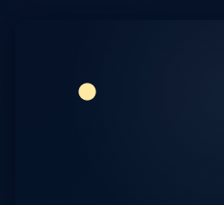


## Dibujo de una pastilla potenciadora 
```javascript

function dibujarPotenciadora (ctx, c, r, size, relleno = '#ffb3c1', colorBorde = 'rgba(255,255,255,0.15)' ) {
  const cx = c * size + size / 2
  const cy = r * size + size / 2
  const radius = Math.max(4, size * 0.35)

  //relleno
  ctx.beginPath()
  ctx.fillStyle = relleno;
  ctx.arc(cx, cy, radius, 0, Math.PI * 2)
  ctx.fill()

  // brillo
  ctx.beginPath()
  ctx.fillStyle = colorBorde;
  ctx.arc(cx - radius * 0.35, cy - radius * 0.35, radius * 0.45, 0, Math.PI * 2)
  ctx.fill()
}

``` 

Puedes probar la función con una llamada como la siguiente:

```javascript
dibujarPotenciadora(ctx, 0,0, TILE_SIZE*5);
```

Se obtendrá algo como lo que se muestra en la siguiente imagen:

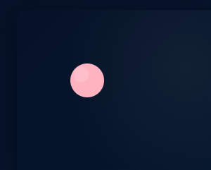


##  Dibujar una fruta

```javascript

function dibujaFruta(ctx, c, r, size) {
    // una cereza estilizada
    const cx = c * size + size / 2
    const cy = r * size + size / 2
    const rFruit = Math.max(5, size * 0.12)

    // tallo
    ctx.beginPath()
    ctx.strokeStyle = '#2c9c2c'
    ctx.lineWidth = Math.max(2, size * 0.02)
    ctx.moveTo(cx - rFruit * 0.2, cy - rFruit * 0.6)
    ctx.quadraticCurveTo(
        cx,
        cy - rFruit * 1.2,
        cx + rFruit * 0.8,
        cy - rFruit * 1.1
    )
    ctx.stroke()

    // fruto
    ctx.beginPath()
    ctx.fillStyle = '#d92148'
    ctx.arc(cx - rFruit * 0.25, cy - rFruit * 0.05, rFruit * 0.85, 0, Math.PI * 2)
    ctx.fill()

    ctx.beginPath()
    ctx.fillStyle = '#c20f3a'
    ctx.arc(cx + rFruit * 0.45, cy + rFruit * 0.05, rFruit * 0.75, 0, Math.PI * 2)
    ctx.fill()

    // brillo
    ctx.beginPath()
    ctx.fillStyle = 'rgba(255,255,255,0.25)'
    ctx.arc(cx - rFruit * 0.45, cy - rFruit * 0.45, rFruit * 0.3, 0, Math.PI * 2)
    ctx.fill()
}

dibujaFruta(ctx, 0, 0, TILE_SIZE * 5)
```


Al hacer una llamada a la función, se obtendrá algo como lo que se muestra en la siguiente imagen:

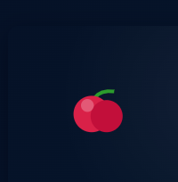

## Dibujar Pacman

```javascript

function dibujarPacman(ctx, c, r, size, direction = 'right', open = 0.2) {
    const cx = c * size + size / 2
    const cy = r * size + size / 2
    const radius = Math.max(6, size * 0.42)

    const mouth = open * Math.PI // ángulo de apertura

    //  ángulos de la boca según dirección
    let start = 0,
        end = Math.PI * 2
    switch (direction) {
        case 'right':
            start = mouth / 2
            end = Math.PI * 2 - mouth / 2
            break
        case 'left':
            start = Math.PI + mouth / 2
            end = Math.PI - mouth / 2
            break
        case 'up':
            start = -Math.PI / 2 + mouth / 2
            end = -Math.PI / 2 - mouth / 2 + Math.PI * 2
            break
        case 'down':
            start = Math.PI / 2 + mouth / 2
            end = Math.PI / 2 - mouth / 2 + Math.PI * 2
            break
    }

    ctx.save()
    // cuerpo del pacman    
    ctx.beginPath()
    ctx.fillStyle = '#ffd700'
    ctx.moveTo(cx, cy)
    ctx.arc(cx, cy, radius, start, end, false)
    ctx.closePath()
    ctx.fill()

    // ojo 
    ctx.beginPath()
    ctx.fillStyle = '#000'
    let ex = cx,
        ey = cy;

    // posición ojo según dirección
    if (direction === 'right') {
        ex += radius * 0.25
        ey -= radius * 0.45
    }
    if (direction === 'left') {
        ex -= radius * 0.25
        ey -= radius * 0.45
    }
    if (direction === 'up') {
        ex -= 0
        ey -= radius * 0.6
    }
    if (direction === 'down') {
        ex -= 0
        ey += radius * 0.1
    }

    //ojo pacman
    ctx.arc(ex, ey, Math.max(2, size * 0.03), 0, Math.PI * 2)
    ctx.fill()

    ctx.restore()
}

```


Al hacer una llamada a la función, se obtendrá algo como lo que se muestra en la siguiente imagen:

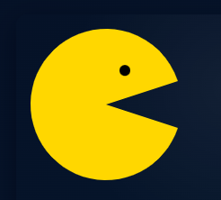


## Dibujar un fantasma

```javascript
function dibujarFantasma(ctx, c, r, size, color = '#ff4050') {
    const x = c * size
    const y = r * size
    const w = size
    const h = size

    ctx.save()
    // cuerpo (semicírculo superior + rect + scallops)
    const cx = x + w / 2
    const cy = y + h / 2
    const radius = w * 0.4

    // cuerpo principal
    ctx.beginPath()
    ctx.fillStyle = color
    ctx.moveTo(x + w * 0.1, y + h * 0.6)
    ctx.lineTo(x + w * 0.1, y + h * 0.35)
    ctx.arc(cx, y + h * 0.35, radius, Math.PI, 0, false)
    ctx.lineTo(x + w * 0.9, y + h * 0.6)

    // ondas 
    const scallopR = w * 0.08
    let sx = x + w * 0.1
    for (let i = 0; i < 5; i++) {
        ctx.arc(sx + scallopR, y + h * 0.6, scallopR, Math.PI, 0, true)
        sx += scallopR * 2
    }

    ctx.closePath()
    ctx.fill()

    // ojos
    ctx.beginPath()
    ctx.fillStyle = '#ffffff'
    ctx.ellipse(
        cx - w * 0.16,
        y + h * 0.35,
        w * 0.12,
        h * 0.16,
        0,
        0,
        Math.PI * 2
    )
    ctx.ellipse(
        cx + w * 0.16,
        y + h * 0.35,
        w * 0.12,
        h * 0.16,
        0,
        0,
        Math.PI * 2
    )
    ctx.fill()

    //iris
    ctx.beginPath()
    ctx.fillStyle = '#000'
    ctx.arc(cx - w * 0.16, y + h * 0.35, w * 0.05, 0, Math.PI * 2)
    ctx.arc(cx + w * 0.11, y + h * 0.35, w * 0.05, 0, Math.PI * 2)
    ctx.fill()

    ctx.restore()
}
```


Al hacer una llamada a la función, se obtendrá algo como lo que se muestra en la siguiente imagen:

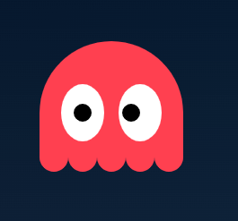


# Función para mostrar elemento de la matriz según posición

Variables para controlar la animación

```javascript
let pacmanDir = 'right'; // 'left','right','up','down' 
let mouthOpen = 0.2; // fracción de PI para abrir la boca
let mouthPulse = 0; // dirección de apertura/cierre de la boca
```


Se dibuja la celda, dependiendo de lo que hay en la matriz.

```javascript
function dibujarCelda(ctx, val, c, r, size) {
    // Primero limpiamos el fondo del tile (pasillo)
    const x = c * size;
    const y = r * size;
    ctx.clearRect(x, y, size, size);

    // dibujamos un suelo sutil para pasillos
    ctx.fillStyle = '#000';
    ctx.fillRect(x, y, size, size);

    switch (val) {
        case 0: // pared
            dubujarPared(ctx, c, r, size);
            break;
        case 1: // pacman 
            dibujarPacman(ctx, c, r, size,
                pacmanDir,
                0.2 + Math.abs(Math.sin(mouthPulse)) * 0.25);
            break;
        case 2: // fantasma
            dibujarPunto(ctx, c, r, size);
            dibujarFantasma(ctx, c, r, size, '#ff5a7a');
            break;
        case 3: // dot
            dibujarPunto(ctx, c, r, size);
            break;
        case 4: // potenciadora
            dibujarPotenciadora(ctx, c, r, size);
            break;
        case 5: // fruta
            dibujaFruta(ctx, c, r, size);
            break;
        case 6: // empty
        default:
            // brillo en pasillos:
            ctx.fillStyle = 'rgba(255,255,255,0.015)';
            ctx.fillRect(x + 1, y + 1, size - 2, size - 2);
            break;
    }
}
```


# Función para mostrar cada frame


Inicializa una variable global para guardar el tiempo del último frame dibujado.


## Agregar variables para controlar la animación 

```Javascript
let lastMoment = performance.now();
let lastAnimation = 0;
let velocidadAnimacion = 4; // frames por segundo
```

```javascript


function dibujarFrame(now) {
    const dseg = (now - lastMoment) / 1000.0;

    if (dseg > 1 / velocidadAnimacion) {
        lastMoment = now;
        console.log('Tiempo', now);
        mouthPulse += 0.25 * Math.PI;

        // limpiar todo el canvas
        ctx.clearRect(0, 0, canvas.width, canvas.height);

        // Recorrer la matriz y dibujar cada celda
        for (let r = 0; r < ROWS; r++) {
            for (let c = 0; c < COLS; c++) {
                const val = MAPA[r][c];
                dibujarCelda(ctx, val, c, r, TILE_SIZE);
            }
        }

    }


    requestAnimationFrame(dibujarFrame);
}
// Empezar animación
requestAnimationFrame(dibujarFrame);
```

* `now` - lastMoment da el tiempo transcurrido (en milisegundos) desde el último frame.

* Al dividir entre 500, se escala a un valor más pequeño, útil para controlar la velocidad de animaciones. 

* Luego se actualiza `lastMoment` con el tiempo actual para el siguiente ciclo.

## Dibujar cada frame
`requestAnimationFrame()` llama automáticamente a tu función (dibujarFrame) pasándole el tiempo actual (now), medido en milisegundos de alta precisión desde que se cargó la página.

```javascript
// Empezar animación
requestAnimationFrame(dibujarFrame);
```


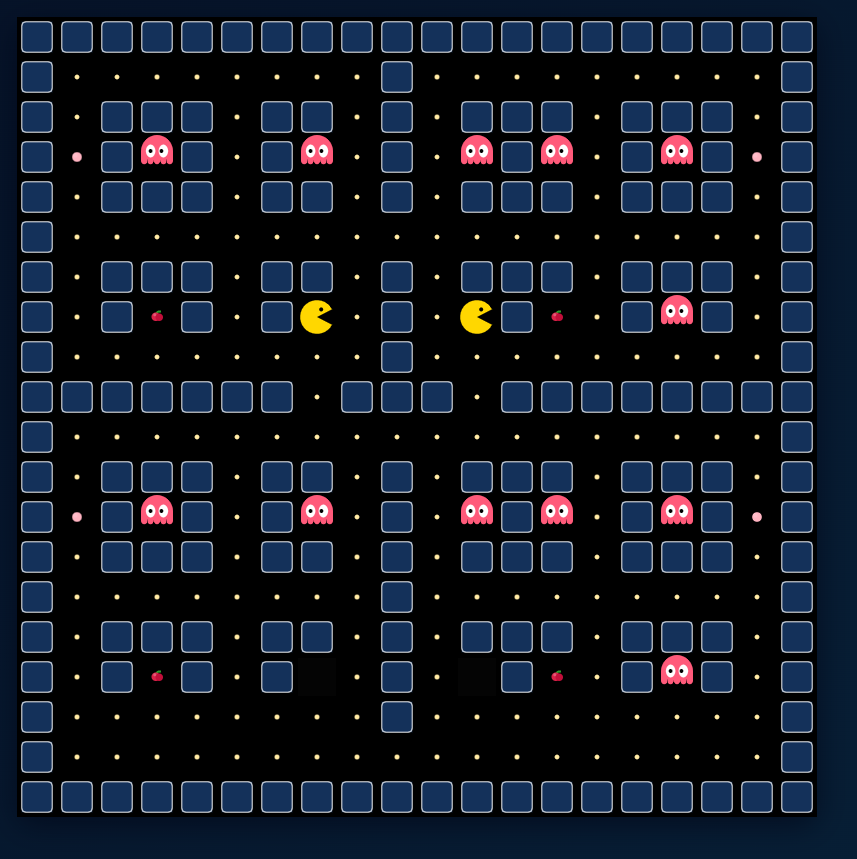 

# Ajustes al MAPA

* Borrar todos los fantasmas
* Borrar el pacman

## Declarar un objeto llamado pacman que controlará 

```Javascript

// posicion inicial del pacman y datos de posición y dirección

let pacman = {
    r: 1, c: 1,
    pacmanX: 1, pacmanY: 1,
    dir: 'left'
};

// posicion donde se dibujará el pacman
MAPA[pacman.r][pacman.c] = 1;
```


# Control de la dirección del pacman

* `pacmanDir` es una variable global.

```Javascript

/// Controles de dirección del Pacman

window.addEventListener('keydown', (e) => {
    const key = e.key;
    if (key === 'ArrowLeft') pacman.dir = 'left';
    if (key === 'ArrowRight') pacman.dir = 'right';
    if (key === 'ArrowUp') pacman.dir = 'up';
    if (key === 'ArrowDown') pacman.dir = 'down';
});
```


## Cálculo de la siguiente posición del pacman

```JavaScript
function nexPosIsAvailable(item) {

    //el objeto item está disponible 
    const dir = item.dir;
    nextC = item.c;
    nextR = item.r;

    //dependiendo de la dirección se calcula la siguiente posible posición
    switch (dir) {
        case 'left':
            nextC -= 1;
            break;
        case 'right':
            nextC += 1;
            break;
        case 'up':
            nextR -= 1;
            break;
        case 'down':
            nextR += 1;
            break;
    }

    // validación de que no pueda salir del área 
    if (nextR < 0 || nextC < 0 || nextR >= ROWS || nextC >= COLS)
        return {
            'isAvailable': false, // fuera del mapa
            'r': item.r, // no se debe mover
            'c': item.c,
            'block': false,
            'inMargin': !(nextR < 0 || nextC < 0 || nextR >= ROWS || nextC >= COLS)
        };
    return {
        'isAvailable': MAPA[nextR][nextC] !== 0, // fuera del mapa
        'r': nextR, // siguiente posición
        'c': nextC,
        'block': MAPA[nextR][nextC] == 0,
        'inMargin': !(nextR < 0 || nextC < 0 || nextR >= ROWS || nextC >= COLS)
    }; //0  es pared

}
```

## Con estos nuevos cambios, ahora es posible controlar el movimiento del pacman en cada frame.

### Actualización de dibujarFrame

```Javascript

function dibujarFrame(now) {

    // cuántos segundos transcurridos desde el frame anterior
    const dseg = (now - lastMoment) / 1000.0;

    // Dependiendo de la velocidad de animación se muestra un nuevo frame
    if (dseg > 1 / velocidadAnimacion) {
        //contador de animacion
        lastAnimation = (lastAnimation + 1) % 4;

        //nuevo 'ultimo momento'
        lastMoment = now;
        //console.log('Tiempo', now);
        //animación de la boca de pacman
        mouthPulse += 0.25 * Math.PI;

        // limpiar todo el canvas
        ctx.clearRect(0, 0, canvas.width, canvas.height);

        // Recorrer la matriz y dibujar cada celda
        for (let r = 0; r < ROWS; r++) {
            for (let c = 0; c < COLS; c++) {
                const val = MAPA[r][c];
                dibujarCelda(ctx, val, c, r, TILE_SIZE);
            }
        }

        //console.log('Pacman en fila:', pacman.r, 'columna:', pacman.c);

        // lastAnimation controla cada cuantos frames se puede mover el pacman  
        // para dar tiempo de moverse en el mapa      
        if (lastAnimation == 0) {
            // mover pacman si la siguiente posición está disponible
            const res = nexPosIsAvailable(pacman);
            //console.log("available", res);

            if (res.isAvailable) {
                // borrar pacman de la posición actual
                MAPA[pacman.r][pacman.c] = 6; // pasillo    
                // actualizar posición
                pacman.c = res.c;
                pacman.r = res.r;
                MAPA[pacman.r][pacman.c] = 1; // pasillo    

                console.log("available", res);
            }
        }
        // mover los fantasmas

        fantasmas.forEach((f, index) => {

            if (lastAnimation % 2 == 0) {
                const dirF = Math.floor(Math.random() * 3.999); // valor entre 0 y 3
                switch (dirF) {
                    case 0: fantasmas[index].dir = 'up'; break;
                    case 1: fantasmas[index].dir = 'right'; break;
                    case 2: fantasmas[index].dir = 'down'; break;
                    case 3: fantasmas[index].dir = 'left'; break;
                }
                const res = nexPosIsAvailable(f);
                //console.log("available", res);

                if (res.isAvailable || (res.block && Math.random() > 0.5)) {
                    // actualizar posición
                    f.c = res.c;
                    f.r = res.r;
                    console.log('res', res);
                    console.log(`fantasma ${index} `, f);

                }
            }

            dibujarFantasma(ctx, f.c, f.r, TILE_SIZE, f.color);

        });


    }


    requestAnimationFrame(dibujarFrame);
}
```

# Fantasmas con movimientos aleatorios

## Declarar arreglo de fantasmas

* Convertir todas las posiciones donde había fantasmas en pastillas (1)

```Javascript

const fantasmas = [
    { 'c': 3, 'r': 3, 'color': '#F87B1B', 'dir': 'right' },
    { 'c': 7, 'r': 3, 'color': '#73C8D2', 'dir': 'right' },
    { 'c': 11, 'r': 3, 'color': '#F87B1B', 'dir': 'right' },
    { 'c': 13, 'r': 3, 'color': '#F87B1B', 'dir': 'right' },
    { 'c': 16, 'r': 3, 'color': '#F87B1B', 'dir': 'right' },
    { 'c': 16, 'r': 7, 'color': '#73C8D2', 'dir': 'right' },
    { 'c': 3, 'r': 12, 'color': '#73C8D2', 'dir': 'right' },
    { 'c': 7, 'r': 12, 'color': '#0046FF', 'dir': 'right' },
    { 'c': 11, 'r': 12, 'color': '#4FB7B3', 'dir': 'right' },
    { 'c': 13, 'r': 12, 'color': '#0046FF', 'dir': 'right' },
    { 'c': 16, 'r': 12, 'color': '#73C8D2', 'dir': 'right' },
    { 'c': 16, 'r': 16, 'color': '#0046FF', 'dir': 'right' }
]
```

## Modificar dibujarFrame - agregar la lógica para mover a los fantasmas

```Javascript
function dibujarFrame(now) {
    // cuántos segundos transcurridos desde el frame anterior
    const dseg = (now - lastMoment) / 1000.0;

    // Dependiendo de la velocidad de animación se muestra un nuevo frame
    if (dseg > 1 / velocidadAnimacion) {
        //contador de animacion
        lastAnimation = (lastAnimation + 1) % 4;

        //nuevo 'ultimo momento'
        lastMoment = now;
        //console.log('Tiempo', now);
        //animación de la boca de pacman
        mouthPulse += 0.25 * Math.PI;

        // limpiar todo el canvas
        ctx.clearRect(0, 0, canvas.width, canvas.height);

        // Recorrer la matriz y dibujar cada celda
        for (let r = 0; r < ROWS; r++) {
            for (let c = 0; c < COLS; c++) {
                const val = MAPA[r][c];
                dibujarCelda(ctx, val, c, r, TILE_SIZE);
            }
        }

        
        // lastAnimation controla cada cuantos frames se puede mover el pacman  
        // para dar tiempo de moverse en el mapa      
        if (lastAnimation == 0) {
            // mover pacman si la siguiente posición está disponible
            const res = nexPosIsAvailable(pacman);            

            if (res.isAvailable) {
                // borrar pacman de la posición actual
                MAPA[pacman.r][pacman.c] = 6; // pasillo    
                // actualizar posición
                pacman.c = res.c;
                pacman.r = res.r;
                MAPA[pacman.r][pacman.c] = 1; // pasillo    

                console.log("available", res);
            }
        }
        // mover los fantasmas

        fantasmas.forEach((f, index) => {

            if (lastAnimation % 2 == 0) {
                const dirF = Math.floor(Math.random() * 3.999); // valor entre 0 y 3
                switch (dirF) {
                    case 0: fantasmas[index].dir = 'up'; break;
                    case 1: fantasmas[index].dir = 'right'; break;
                    case 2: fantasmas[index].dir = 'down'; break;
                    case 3: fantasmas[index].dir = 'left'; break;
                }
                const res = nexPosIsAvailable(f);                

                if (res.isAvailable) {
                    // actualizar posición
                    f.c = res.c;
                    f.r = res.r;
                    console.log(`fantasma ${index} `, f);

                }
            }

            dibujarFantasma(ctx, f.c, f.r, TILE_SIZE, f.color);

        });


    }


    requestAnimationFrame(dibujarFrame);
}
```
# Pendientes


 


## Lógica para 

```Javascript

fantasmas.forEach((f, index) => {

    if (lastAnimation % 2 == 0) {

        // CONTROL DE FANTASMAS QUE SE COMPORTAN ALEATORIAMENTE
        if (index > 3) {

            const dirF = Math.floor(Math.random() * 3.999); // valor entre 0 y 3
            switch (dirF) {
                case 0: fantasmas[index].dir = 'up'; break;
                case 1: fantasmas[index].dir = 'right'; break;
                case 2: fantasmas[index].dir = 'down'; break;
                case 3: fantasmas[index].dir = 'left'; break;
            }
        } else {
            // FANTASMAS QUE SE MUEVEN SEGUN POSICIÓN DEL PACMAN
            // detectar dirección del pacman y dirigir el fantasma
            // pacman está a la izquierda
            console.log("pacman", pacman, "fantasma", f);
            console.log(`${Math.abs(pacman.c - f.c)} > ${Math.abs(pacman.r - f.r)}`);
            if (Math.abs(pacman.c - f.c) > Math.abs(pacman.r - f.r)) {
                // el pacman está a la izquierda
                console.log("columna", pacman.c < f.c);
                if (pacman.c < f.c) {
                    fantasmas[index].dir = 'left';
                } else {
                    fantasmas[index].dir = 'right';
                }
            } else {
                //pacman está arriba
                console.log("fila", pacman.r < f.r);
                if (pacman.r < f.r) {
                    fantasmas[index].dir = 'up';
                } else {
                    fantasmas[index].dir = 'down';
                }
            }
        }


        const res = nexPosIsAvailable(f);
        //console.log("available", res);

        if (res.isAvailable || (res.block && Math.random() > 0.9)) {
            // actualizar posición
            f.c = res.c;
            f.r = res.r;
            //console.log('res', res);
            //console.log(`fantasma ${index} `, f);
        }
    }

    dibujarFantasma(ctx, f.c, f.r, TILE_SIZE, f.color);

});
 
```

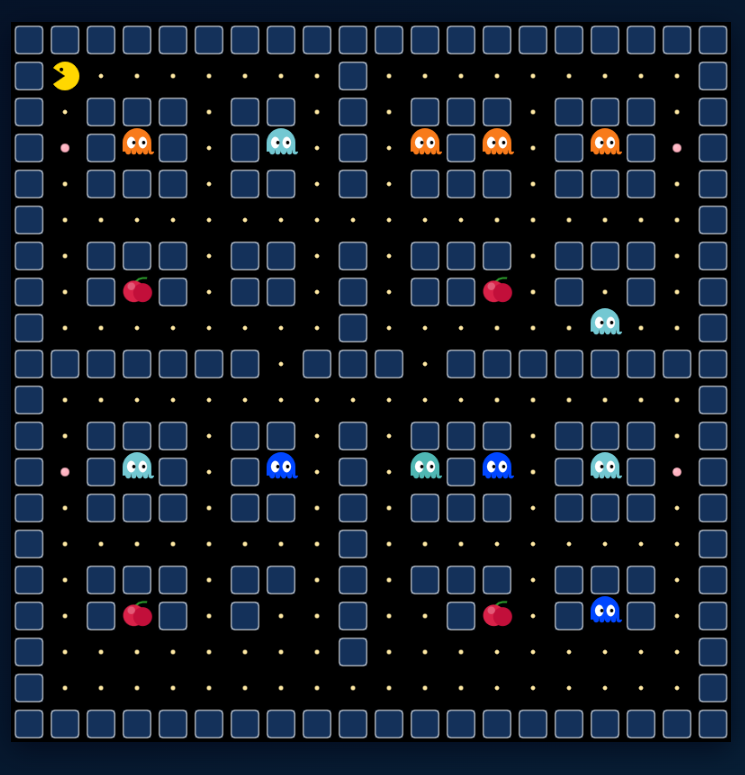 